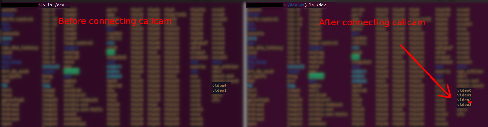
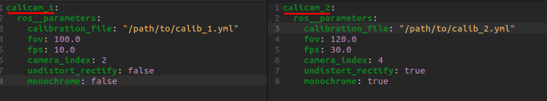
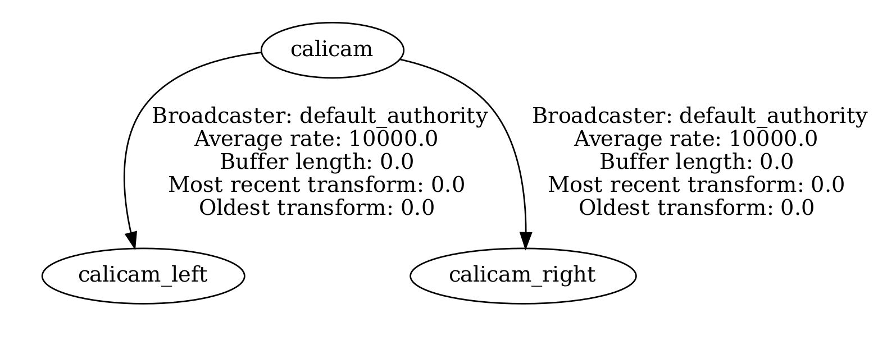

# Calicam_ros

A simple ros2 driver for calicam stereo and monocular cameras. Code is based on the official [repo](https://github.com/astar-ai/calicam).

## 1. Dependencies

> sudo apt install ros-$ROS_DISTRO-cv-bridge

## 2. How to use

**Make sure to add the calibration file path in the paramaters file**

To download the unique calibration file for your camera:
> wget [https://astar.support/data/181220/21-181220-0001.yml](https://astar.support/data/181220/21-181220-0001.yml)

Replace the serial number in the URL with the one on your camera.

To figure out the camera index for your calicam, unplug it if you have it plugged in and run:
> ls /dev

If you have any other cameras connected to your computer like a webcam they will show up as video sources, take note of them. Then connect the calicam and run the command again. You should see 2 more video sources pop up. The first of those is your calicam and you should use that index.

Run with launch:
> ros2 launch calicam_ros calicam

or with specified params file:
> ros2 launch calicam_ros calicam params_file:=*/full/path/to/params/file.yaml/*

Run without launch:
> ros2 run calicam_ros calicam --ros-args --params_file */full/path/to/params/file.yaml*

There is also a rectifier_node to use on recorded bags to rectify raw recorded images. You can run it like so:
> ros2 launch calicam_ros rectifier_node
> 
> ros2 launch calicam_ros rectifier_node params_file:=*/full/path/to/params/file.yaml/*
> 
> ros2 run calicam_ros rectifier_node --ros-args --params_file */full/path/to/params/file.yaml*

The calicam and rectifier_node have seperate paramater files.

## 3. Usage with multiple cameras

To use multiple cameras you have to either change the node name for each node or the namespace. Here is an example:

> ros2 launch calicam_ros calicam params_file:=*/full/path/to/params/file_1.yaml/* node_name:=calicam_1

In another terminal:
> ros2 launch calicam_ros calicam params_file:=*/full/path/to/params/file_2.yaml/* node_name:=calicam_2

Make sure to change the node name at the top of each parameter file to mach the name you assigne to each node.

## 4. Paramaters

Modify the paramaters in the calicam.yaml or rectifier_node.yaml paramater files to your needs

| Paramater | Type | Description |
| ----------- | ----------- | ----------- |
| calibration_file | string | Full path to camera calibration file |
| fov | double | Field of view for rectified image |
| fps | double | How many frames to publis per second (is limited by camera) |
| camera_index | int | Index of the camera (typically 0) |
| undistort_rectify | bool | Whether to publish undistorted and rectified images |
| monochrome | bool | Whether to publish monochrome images |

You can change the resolution by changing cap_size in the calibration file. Supported resolutions for mono camera ar 1280x960 and 640x480. Supported resolutions for the stereo camera ar 2560x960 and 1280x480.

## 5. Published topics

| Topic | Type | Description |
| ----------- | ----------- | ----------- |
| /calicam/left/camera_info | sensor_msgs/CameraInfo | Information about the left camera like resolution and distortion paramaters |
| /calicam/left/image_raw | sensor_msgs/Image | Raw image from the left camera (can be ether colored or monochrome depending on configuration) |
| /calicam/left/image_rect | sensor_msgs/Image | Rectified left camera image |
| /calicam/right/camera_info | sensor_msgs/CameraInfo | Information about the right camera like resolution and distortion paramaters |
| /calicam/right/image_raw | sensor_msgs/Image | Raw image from the right camera (can be ether colored or monochrome depending on configuration) |
| /calicam/right/image_rect | sensor_msgs/Image | Rectified right camera image |

The suffix for each topic name is the name of the node, in this case the default *calicam*.

If using a mono camera only the left camera will be published but both topics will exist.

## 6. Transforms

The suffix for each frame is the node name. In this example it is the default node name *calicam*. As an example if the node name is changed to calicam_1 then the three frames would be named as follows: calicam_1, calicam_1_left, calicam_1_right

The calicam frame is in the ros coordinate system (x-forwards, y-left, z-up). It's position is the same as the calicam_left frame. The left and right camera frames are in the camera coordinate frame (z-forwards, x-right, y-down). The calicam frame rotates these frames to the ros coordinate system. If you are using a mono camera then the right frame won't exist.

## TO DO

1. Make paramaters to change resolution
2. Make service for dynamic fov changing
3. Make service for dynamic resolution changing
